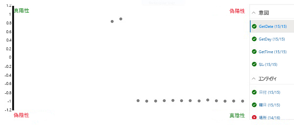

---
lab:
    title: 'Language Understanding アプリの作成'
    module: 'モジュール 5 - Language Understanding ソリューションの作成'
---

# Language Understanding アプリの作成

Language Understanding サービスを使用すると、アプリケーションがユーザーからの自然言語入力を解釈し、ユーザーの*意図* (達成したいこと) を予測し、意図を適用する必要がある*エンティティ*を特定するために使用できる言語モデルをカプセル化するアプリを定義できます。

たとえば、時計アプリケーション用の言語理解アプリは、次のような入力を処理することが期待される場合があります。

*ロンドンは何時ですか。*

この種の入力は、*発話* (ユーザーが言うまたは入力する可能性のあるもの) の例です。特定の場所 (*エンティティ*) で時間を取得することが*意図*です。この場合、ロンドンです。

> **注**: 言語理解アプリのタスクは、ユーザーの意図を予測し、意図が適用されるエンティティを特定することです。意図を満たすために必要なアクションを実際に実行することは、その仕事では<u>ありません</u>。たとえば、時計アプリケーションは言語アプリを使用して、ユーザーがロンドンの時刻を知りたいことを識別できます。ただし、クライアント アプリケーション自体は、正しい時刻を決定してユーザーに提示するロジックを実装する必要があります。

## このコースのリポジトリを複製する

**AI-102-AIEngineer** コードのリポジトリをこのラボで作業している環境にまだ複製していない場合は、次の手順に従って複製してください。それ以外の場合は、複製されたフォルダーを Visual Studio Code で開きます。

1. Visual Studio Code を起動します。
2. パレットを開き (SHIFT+CTRL+P)、**Git: Clone** コマンドを実行して、 `https://github.com/MicrosoftLearning/AI-102JA-Designing-and-Implementing-a-Microsoft-Azure-AI-Solution` リポジトリをローカル フォルダーに複製します (どのフォルダーでもかまいません)。
3. リポジトリを複製したら、Visual Studio Code でフォルダーを開きます。
4. リポジトリ内の C# コード プロジェクトをサポートするために追加のファイルがインストールされるまで待ちます。

    > **注**: ビルドとデバッグに必要なアセットを追加するように求められた場合は、**「今はしない」** を選択します。

## Language Understanding リソースの作成

Language Understanding サービスを使用するには、次の 2 種類のリソースが必要です。

- *オーサリング* リソース: Language Understanding アプリの定義、トレーニング、およびテストに使用されます。これは、Azure サブスクリプションの **Language Understanding - オーサリング** リソースである必要があります。
- *予測*リソース: Language Understandingアプリを公開し、それを使用するクライアント アプリケーションからのリクエストを処理するために使用されます。これは、Azure サブスクリプションの **Language Understanding** または **Cognitive Services** リソースのいずれかです。

     > **重要**：オーサリングリソースは、3 つの*リージョン* (ヨーロッパ、オーストラリア、または米国) のいずれかで作成する必要があります。ヨーロッパまたはオーストラリアのオーサリング リソースで作成された Language Understanding アプリは、それぞれヨーロッパまたはオーストラリアの予測リソースにのみデプロイできます。米国のオーサリング リソースで作成されたモデルは、ヨーロッパとオーストラリア以外の Azure の場所にある予測リソースにデプロイできます。一致するオーサリングと予測の場所の詳細については、[オーサリングとパブリッシング リージョンのドキュメント](https://docs.microsoft.com/azure/cognitive-services/luis/luis-reference-regions)を参照してください。

言語理解のオーサリングおよび予測リソースをまだ持っていない場合：

1. `https://portal.azure.com` で Azure portal を開き、Azure サブスクリプションに関連付けられている Microsoft アカウントを使用してサインインします。
2. **&#65291;「リソースの作成」** ボタンを選択し、*Language Understanding* を検索して、次の設定で **Language Understanding** リソースを作成します。

    *Language Understanding (Azure Cognitive Services) では<u>なく</u>、**Language Understanding** を選択していることを確認してください*

    - **作成オプション**: 両方
    - **サブスクリプション**: *お使いの Azure サブスクリプション*
    - **リソース グループ**: *リソース グループを選択または作成します (制限付きサブスクリプションを使用している場合は、新しいリソース グループを作成する権限がない可能性があります - 提供されているものを使用してください)*
    - **名前**: *一意の名前を入力します*
    - **オーサリングの場所**: *希望する場所を選択します*
    - **オーサリングの価格レベル**: F0
    - **予測の場所**: *オーサリングの場所と同じ*
    - **予測の価格レベル**: F0
3. リソースが作成されるのを待ち、2 つの Language Understanding リソースがプロビジョニングされることに注意してください。1 つはオーサリング用で、もう 1 つは予測用です。作成したリソース グループに移動すると、これらの両方を表示できます。 **「リソースに移動」** を選択すると、*オーサリング* リソースが開きます。

## Language Understanding アプリを作成する

オーサリング リソースを作成したので、それを使用して Language Understanding アプリを作成できます。

1. 新しいブラウザタブで、`https://www.luis.ai` の Language Understanding ポータルを開きます。
2. Azure サブスクリプションに関連付けられている Microsoft アカウントを使用してサインインします。Language Understanding ポータルに初めてサインインする場合は、アカウントの詳細にアクセスするためのアクセス許可をアプリに付与する必要がある場合があります。次に、Azure サブスクリプションと作成したオーサリングリ ソースを選択して、*ようこそ*手順を完了します。

    > **注**: アカウントが異なるディレクトリ内の複数のサブスクリプションに関連付けられている場合は、Language Understanding リソースをプロビジョニングしたサブスクリプションを含むディレクトリに切り替える必要がある場合があります。

3. **「会話アプリ」** ページで、サブスクリプションと Language Understanding オーサリング リソースが選択されていることを確認します。次に、次の設定で会話用の新しいアプリを作成します。
    - **名前**: Clock
    - **文化**: English (*このオプションが使用できない場合は空白のままにします*)
    - **説明**: Natural language clock
    - **予測リソース**: *Language Understanding 予測リソース*

    **Clock**アプリが自動的に開かない場合は、それを開いてください。
    
    効果的な Language Understanding アプリを作成するためのヒントが記載されたパネルが表示されたら、それを閉じます。

## 意図の作成

新しいアプリで最初に行うことは、いくつかの意図を定義することです。

1. **「Intents」**ページで、**「作成」** を選択し、**GetTime** という名前の新しい意図を作成します。
2. **GetTime** の意図のページで、ユーザー入力の例として次の発話を追加します

    *what is the time?*

    *what time is it?*

3. これらの発話を追加したら、**「Intents」** ページに戻り、次の発話を含む **GetDay** という名前の別の新しい意図を追加します。

    *what is the day today?*

    *what day is it?*

4. これらの発話を追加したら、**「Intents」** ページに戻り、次の発話を含む **GetDate** という名前の別の新しい意図を追加します。

    *what is the date today?*

    *what date is it?*

5. これらの発話を追加したら、**「Intents」** ページに戻り、**None** 意図を選択します。これは、言語モデルで定義した意図のいずれにもマップされない入力のフォールバックとして提供されます。
6. 次の発話を **None** 意図に追加します。

    *hello*

    *goodbye*

## アプリの訓練およびテスト

意図をいくつか追加したので、アプリをトレーニングして、ユーザー入力から正しく予測できるかどうかを確認しましょう。

1. ポータルの右上で、**「Train」** を選択してアプリをトレーニングします。
2. アプリがトレーニングされたら、 **「テスト」** を選択して 「テスト」 パネルを表示し、次のテスト発話を入力します。

    *what's the time now?*

    返された結果を確認します。予測された意図 (**GetTime**である必要があります) と、予測された意図に対してモデルが計算した確率を示す信頼スコアが含まれていることに注意してください。

3. 次のテスト発話を試してください。

    *tell me the time*

    もう一度、予測された意図と信頼スコアを確認します。

4. 次のテスト発話を試してください。

    *what's today?*

    うまくいけば、モデルは **GetDay** 意図を予測します。

5. 最後に、このテスト発話を試してください。

    *hi*

    これにより、**None** 意図が返されます。

6. 「テスト」 パネルを閉じます。

## エンティティを追加する

これまで、意図にマップするいくつかの簡単な発話を定義しました。ほとんどの実際のアプリケーションには、より複雑な発話が含まれており、意図のコンテキストを増やすために、特定のデータ エンティティを抽出する必要があります。

### *機械学習*エンティティを追加する

最も一般的な種類のエンティティは*機械学習*エンティティであり、アプリは例に基づいてエンティティ値を識別することを学習します。

1. **「Entities」** ページで、**「作成」** を選択し、新しいエンティティを作成します。
2. **「エンティティの作成」** ダイアログボックスで、**Location** という名前の **機械学習済み(Machine learned)** エンティティを作成します。
3. **Location** エンティティが作成されたら、**「Intents」** ページに戻り、**GetTime** 意図を選択します。
4. 次の新しい発話例を入力します。

    *what time is it in London?*

5. 発話が追加されたら、***london*** という単語を選択し、表示されるドロップダウンリストで **「Location」** を選択して、「london」が場所の例であることを示します。
6. 別の発話例を追加します。

    *what is the current time in New York?*

7. 発話が追加されたら、***new york*** という単語を選択し、それらを **Location** エンティティにマップします。

### *リスト* エンティティを追加する

場合によっては、エンティティの有効な値を特定の用語と同義語のリストに制限できます。これは、アプリが発話内のエンティティのインスタンスを識別するのに役立ちます。

1. **「Entities」** ページで、**「作成」** を選択し、新しいエンティティを作成します。
2. **「エンティティの作成」** ダイアログボックスで、**Weekday** という名前の**リスト(List)** エンティティを作成します。
3. 次の**正規化された値**と**シノニム**を追加します。

    | 正規化された値 | シノニム|
    |-------------------|---------|
    | sunday | sun |
    | monday | mon |
    | tuesday | tue |
    | wednesday | wed |
    | thursday | thu |
    | friday | fri |
    | saturday | sat |

3. **Weekday** エンティティが作成されたら、**「Intents」** ページに戻り、**GetDate** 意図を選択します。
4. 次の新しい発話例を入力します。

    *what date was it on Saturday?*

5. 発話が追加されたら、**saturday** が **Weekday** エンティティに自動的にマップされていることを確認します。そうでない場合は、***saturday*** という単語を選択し、表示されるドロップダウンリストで **「Weekday」** を選択します。
6. 別の発話例を追加します。

    *what date will it be on Friday?*

7. 発話が追加されたら、**friday** が **Weekday** エンティティにマップされていることを確認します。

### *正規表現*エンティティを追加する

エンティティには、シリアル番号、フォームコード、日付などの特定の形式がある場合があります。アプリが一致するエンティティ値を識別するのに役立つ、予想される形式を説明する正規表現 (*regex*) を定義できます。

1. **「Entities」** ページで、**「作成」** を選択し、新しいエンティティを作成します。
2. **「エンティティの作成」** ダイアログボックスで、次の正規表現を使用して **Date** という名前の **正規表現(Regex)** エンティティを作成します。

    ```
    [0-9]{2}/[0-9]{2}/[0-9]{4}
    ```

    > **注**: これは単純な正規表現です。これは、2 桁の後に「/」、別の2桁、別の「/」、および 4 桁が続くかどうかをチェックします (たとえば、*01/11/2020*)。*56/00/9999* などの無効な日付を許可します。ただし、エンティティ正規表現は、日付値を検証するためではなく、日付として*意図された*データ入力を識別するために使用されることを覚えておくことが重要です。

3. **Date** エンティティが作成されたら、**「Intents」** ページに戻り、**GetDay** 意図を選択します。
4. 次の新しい発話例を入力します。

    *what day was 01/01/1901?*

5. 発話が追加されたら、**01/01/1901** が自動的に **Date** エンティティにマップされていることを確認します。そうでない場合は、**01/01/1901** を選択し、表示されるドロップダウンリストで **「日付」** を選択します。
6. 別の発話例を追加します。

    *what day will it be on 12/12/2099?*

7. 発話が追加されたら、**12/12/2099** が **Date** エンティティにマップされていることを確認します。

### アプリを再トレーニングする

言語モデルを変更したので、アプリを再トレーニングして再テストする必要があります。

1. ポータルの右上で、**「Train」** を選択してアプリを再トレーニングします。
2. アプリがトレーニングされたら、**「テスト」** を選択して 「テスト」 パネルを表示し、次のテスト発話を入力します。

    *what's the time in Edinburgh?*

3. 返される結果を確認します。これにより、**GetTime** の意図が予測されるはずです。次に、**「検査」** を選択し、表示される追加の検査パネルで、**「ML エンティティ」** セクションを調べます。モデルは、「edinburgh」が **Location** エンティティのインスタンスであると予測するはずです。
4. 次の発話をテストしてみてください。

    *what date is it on Friday?*

    *what's the date on Thu?*

    *what was the day on 01/01/2020?*

5. テストが終了したら、検査パネルを閉じますが、テスト パネルは開いたままにしておきます。

## バッチ テストを実行する

テスト ペインを使用して個々の発話をインタラクティブにテストできますが、より複雑な言語モデルの場合は、通常、*バッチ テスト*を実行する方が効率的です。

1. Visual Studio Code で、**09-luis-app** フォルダーにある **batch-test.json** ファイルを開きます。このファイルは、作成した時計言語モデルの複数のテストケースを含む JSON ドキュメントで構成されています。
2. Language Understanding ポータルの「テスト」 パネルで、**「バッチテスト」 パネル**を選択します。次に、**「インポート」** を選択し、**batch-test.json** ファイルをインポートして、**clock-test** という名前を割り当てます。
3. 「バッチ テスト」 パネルで、**clock-test** テストを実行します。
4. テストが完了したら、**「結果を表示」** を選択します。
5. 結果ページで、予測結果を表す混同行列を表示します。右側のリストで選択されている意図またはエンティティの真陽性、偽陽性、真陰性、および偽陰性の予測が表示されます。

    

    > **注**: 各発話は、各意図に対して*正*または*負*としてスコアリングされます。たとえば、「what time is it?」について、**GetTime** *意図*の場合は正、**GetDate** 意図の場合は*負*としてスコアリングする必要があります。混同行列上のポイントは、選択した意図に対してどの発話が*正*および*負*として正しく予測されたか (*true*)、誤って予測されたか (*false*) を示します。

6. **GetDate** 意図を選択した状態で、混同行列上の任意のポイントを選択して、予測の詳細 (発話や予測の信頼度スコアなど) を確認します。次に、**GetDay**、**GetTime**、および **None** 意図を選択し、それらの予測結果を表示します。アプリは、意図を正しく予測できるように、うまく機能しているはずです。

    > **注**: ユーザー インターフェイスは、以前に選択したポイントをクリアしない場合があります。

7. **Location** エンティティを選択し、混同行列で予測結果を表示します。特に、*偽陰性* - であった予測に注意してください。これらは、アプリが発話内の指定された場所を検出できなかった場合であり、意図にサンプル発話を追加してモデルを再トレーニングする必要がある可能性があることを示しています。
8. 「バッチ テスト」 パネルを閉じます。

## アプリを公開する

実際のプロジェクトでは、予測パフォーマンスに満足するまで、意図とエンティティを繰り返し改良し、再トレーニングして、再テストします。次に、クライアント アプリケーションが使用できるようにアプリを公開できます。

1. Language Understanding ポータルの右上にある **「Publish」** を選択します。
2. **「実稼働スロット」** を選択し、アプリを公開します。
3. 公開が完了したら、Language Understanding ポータルの上部にある **「管理」** を選択します。
4. **「設定」** ページで、**アプリ ID** をメモします。クライアント アプリケーションがアプリを使用するには、これが必要です。
5. **「Azure リソース」** ページで、アプリを使用できる予測リソースの**プライマリ キー**、**セカンダリ キー**、および**エンドポイント URL** をメモします。クライアント アプリケーションは、予測リソースに接続して認証されるために、エンドポイントとキーの 1 つを必要とします。
6. Visual Studio Code の **09-luis-app** フォルダーで、**GetIntent.cmd** バッチ ファイルを選択し、そこに含まれるコードを表示します。このコマンドライン スクリプトは、cURL を使用して、指定されたアプリケーションと予測エンドポイントの Language Understanding REST API を呼び出します。
7. スクリプト内のプレースホルダー値を、**アプリ ID**、**エンドポイント URL**、および Language Understanding アプリの**プライマリ キー**または**セカンダリ キー**のいずれかに置き換えます。次に、更新したファイルを保存します。
8. **09-luis-app** フォルダーを右クリックして、統合ターミナルを開きます。次に、次のコマンドを入力します (必ず引用符を含めてください)。

    ```
    GetIntent "What's the time?"
    ```

9. アプリから返された JSON 応答を確認します。これは、入力に対して予測された最高スコアの意図を示している必要があります (**GetTime** である必要があります)。
10. 次のコマンドをお試しください。

    ```
    GetIntent "What's today's date?"
    ```

11. 応答を調べて、**GetDate** 意図を予測していることを確認します。
12. 次のコマンドをお試しください。

    ```
    GetIntent "What time is it in Sydney?"
    ```

13. 応答を調べて、**Location** エンティティが含まれていることを確認します。

14. 次のコマンドを試して、応答を調べてください。

    ```
    GetIntent "What time is it in Glasgow?"
    ```

    ```
    GetIntent "What's the time in Nairobi?"
    ```

    ```
    GetIntent "What's the UK time?"
    ```
15. さらにいくつかのバリエーションを試してください。目標は、**GetTime** 意図を正しく予測するが、**Location** エンティティの検出に失敗する少なくともいくつかの応答を生成することです。

    ターミナルを開いたままにします。後で戻ります。

## *アクティブ ラーニング*を適用する

エンドポイントに送信された過去の発話に基づいて、Language Understanding アプリを改善できます。この実践は*アクティブ ラーニング*と呼ばれます。

前の手順では、cURL を使用してアプリのエンドポイントにリクエストを送信しました。これらのリクエストには、クエリをログに記録するオプションが含まれていました。これにより、アプリはアクティブ ラーニングで使用するためにクエリを追跡できます。

1. Language Understanding ポータルで、**「ビルド」** を選択し、**「エンドポイントの発話の確認」** ページを表示します。このページには、サービスがレビュー用にフラグを付けたログに記録された発話が一覧表示されます。
2. 意図と新しい Location エンティティ (元のトレーニング発話に含まれていなかった) が正しく予測された発話については、**&#10003;** を選択してエンティティを確認し、**&#10514;** アイコンを使用して、トレーニングの例として、発話を意図に追加します。
3. **GetTime** 意図が正しく識別されたが、**Location** エンティティが識別され <u>なかった</u> 発話の例を見つけます。Location 名を選択して、**Location** エンティティにマップします。次に、**&#10514;** アイコンを使用して、トレーニングの例として発話を意図に追加します。
4. **「Intents」** ページに移動し、**GetTime** 意図を開いて、提案された発話が追加されたことを確認します。
5. Language Understanding ポータルの上部にある **「Train」** を選択して、アプリを再トレーニングします。
6. Language Understanding ポータルの右上にある **「Publish」 **を選択し、アプリを**実稼働スロット**に再公開します。
7. **09-luis-app** フォルダーのターミナルに戻り、**GetIntent** コマンドを使用して、アクティブ ラーニング中に追加および修正した発話を送信します。
8. 結果に **Location** エンティティが含まれていることを確認します。次に、同じ言い回しを使用しているが、別の場所を指定している別の発話を試してください (たとえば、*Berlin*)。

## アプリをエクスポートする

Language Understanding ポータルを使用して言語アプリを開発およびテストできますが、DevOps のソフトウェア開発プロセスでは、継続的インテグレーションとデリバリー (CI/CD) パイプラインに含めることができるアプリのソース制御定義を維持する必要があります。コード スクリプトで Language Understanding SDK または REST API を使用してアプリを作成およびトレーニング*できます*が、より簡単な方法は、ポータルを使用してアプリを作成し、それを *lu* ファイルとしてエクスポートして、別の言語理解インスタンスにインポートして再トレーニングできるようにすることです。このアプローチにより、アプリの移植性と再現性を維持しながら、ポータルの生産性のメリットを活用できます。

1. Language Understanding ポータルで、**「管理」** を選択します。
2. **「バージョン」** ページで、アプリの現在のバージョンを選択します (1 つだけである必要があります)。
3. **「エクスポート」** ドロップダウンリストで、**「LU としてエクスポート」** を選択します。次に、ブラウザーのプロンプトが表示されたら、ファイルを **09-luis-app** フォルダーに保存します。
4. Visual Studio Code で、エクスポートしてダウンロードした **lu** ファイルを開きます (マーケットプレイスでそれを読み取ることができる拡張機能を検索するように求められた場合は、プロンプトを閉じます)。LU 形式は人間が読める形式であるため、チーム開発環境で Language Understanding アプリの定義を文書化する効果的な方法であることに注意してください。

## 詳細情報

**Language Understanding** サービスの使用の詳細については、[Language Understanding のドキュメント](https://docs.microsoft.com/azure/cognitive-services/luis/)を参照してください。
