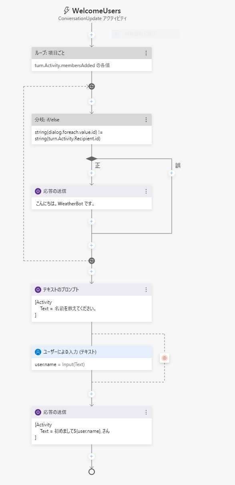
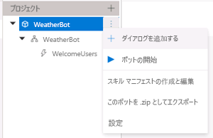
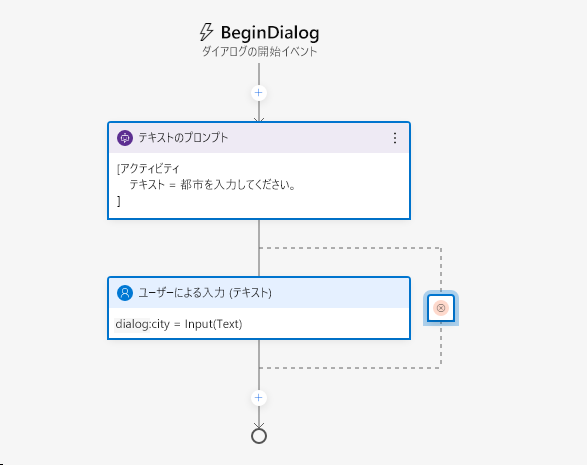
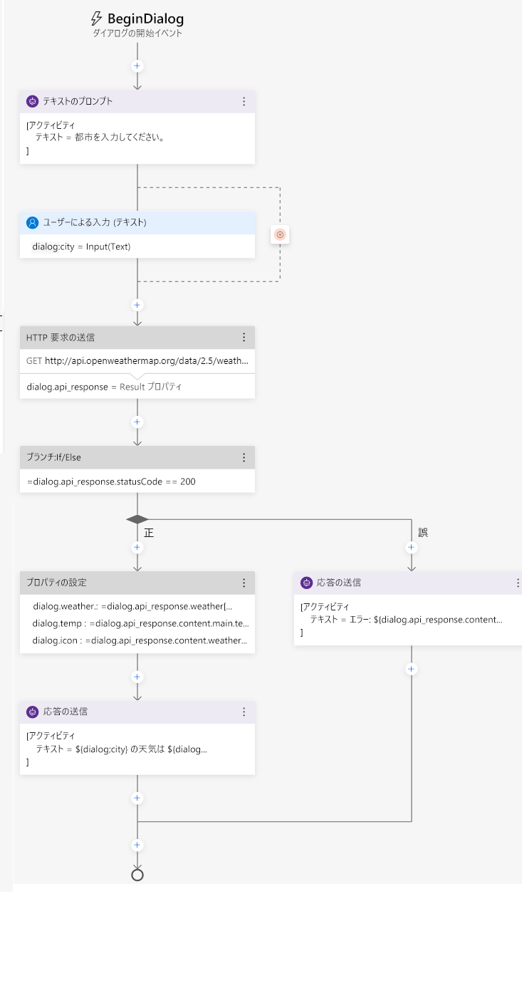
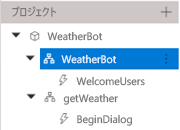
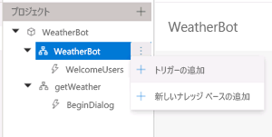
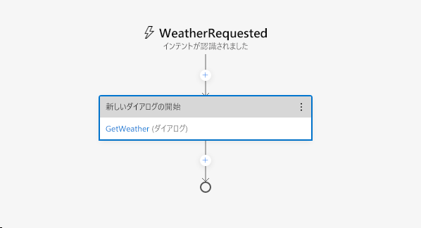

---
lab:
  title: Bot Framework Composer を使用したボットの作成
  module: Module 7 - Conversational AI and the Azure Bot Service
---

# <a name="create-a-bot-with-bot-framework-composer"></a>Bot Framework Composer を使用したボットの作成

Bot Framework Composer is a graphical designer that lets you quickly and easily build sophisticated conversational bots without writing code. The composer is an open-source tool that presents a visual canvas for building bots.

## <a name="prepare-to-develop-a-bot"></a>ボットを開発する準備をする

初めに、ボットの開発に必要なサービスとツールを準備します。

### <a name="get-an-openweather-api-key"></a>OpenWeather API キーを取得する

In this exercise, you will create a bot that uses the OpenWeather service to retrieve weather conditions for the city entered by the user. You will require an API key for the service to work.

1. Web ブラウザーで、OpenWeather サイト (`https://openweathermap.org/price`) にアクセスします。
2. 無料の API キーをリクエストし、OpenWeather アカウントを作成します (まだ持っていない場合)。
3. サインアップ後、 **[API keys]\(API キー\)** ページを表示して API キーを確認します。

### <a name="update-bot-framework-composer"></a>Bot Framework Composer を更新する

You're going to use the Bot Framework Composer to create your bot. This tools is updated regularly, so let's make sure you have the latest version installed.

> **注**: 更新には、この演習の手順に影響を与えるユーザー インターフェイスの変更が含まれる場合があります。

1. **Bot Framework Composer** を起動し、更新をインストールするプロンプトが自動的表示されない場合は、 **[ヘルプ]** メニューの **[更新の確認]** オプションを使用して更新を確認します。
2. Bot Framework Composer は、コードを記述せずに高度な会話型ボットをすばやく簡単に構築できるグラフィカル デザイナーです。
3. Bot Framework Composer のバージョンが **2.0.0** 以降であることを確認します。

## <a name="create-a-bot"></a>ボットの作成

これで、Bot Framework Composer を使用してボットを作成する準備ができました。

### <a name="create-a-bot-and-customize-the-welcome-dialog-flow"></a>ボットを作成し、"welcome" ダイアログ フローをカスタマイズする

1. Bot Framework Composer がまだ開いていない場合は、起動します。
2. Composer は、ボットを構築するためのビジュアル キャンバスを提供するオープンソース ツールです。
3. Close the <bpt id="p1">**</bpt>Get Started<ept id="p1">**</ept> pane if it opens, and then in the navigation pane on the left, select <bpt id="p2">**</bpt>Greeting<ept id="p2">**</ept> to open the authoring canvas and show the <bpt id="p3">*</bpt>ConversationUpdate<ept id="p3">*</ept> activity that is called when a user initially joins a conversation with the bot. The activity consists of a flow of actions.
4. 右側のプロパティ ペインで、上部にある **Greeting** という単語を選択し、それを「**WelcomeUsers**」に変更して、**Greeting** というタイトルを編集します。
5. In the authoring canvas, select the <bpt id="p1">**</bpt>Send a response<ept id="p1">**</ept> action. Then, in the properties pane, change the default text from <bpt id="p1">*</bpt>Hi to your bot<ept id="p1">*</ept>  to <ph id="ph1">`Hi! I'm WeatherBot.`</ph>
6. オーサリング キャンバスで、最後の **[+]** 記号 (ダイアログ フローの<u>終わり</u>を示す円のすぐ上) を選択し、 **[テキスト]** 応答に新しい **[質問する]** アクションを追加します。

    The new action creates two nodes in the dialog flow. The first node defines a prompt for the bot to ask the user a question, and the second node represents the response that will be received from the user. In the properties pane, these nodes have corresponding <bpt id="p1">**</bpt>Bot response<ept id="p1">**</ept> and <bpt id="p2">**</bpt>User input<ept id="p2">**</ept> tabs.

7. In the properties pane, on the <bpt id="p1">**</bpt>Bot response<ept id="p1">**</ept> tab, add a response with the text <ph id="ph1">`What's your name?`</ph>. Then, on the <bpt id="p1">**</bpt>User input<ept id="p1">**</ept> tab, set the <bpt id="p2">**</bpt>Property<ept id="p2">**</ept> value to <ph id="ph1">`user.name`</ph> to define a variable that you can access later in the bot conversation.
8. 作成キャンバスに戻り、先ほど追加した **[User input (Text)]\(ユーザー入力 (テキスト)\)** アクションの下の **+** 記号を選択し、 **[Send a response]\(応答の送信\)** アクションを追加します。
9. 新しく追加した **[Send a response]\(応答の送信\)** アクションを選択し、プロパティ ペインで、テキスト値を「`Hello ${user.name}, nice to meet you!`」に設定します。

    完成したアクティビティ フローはこのようになります。

    

### <a name="test-the-bot"></a>ボットのテスト

基本的なボットが完成したのでテストしてみましょう。

1. この演習では、Open Weather サービスを使用してユーザーが入力した地域の気象条件を取得するボットを作成します。

    - Windows ファイアウォールのメッセージが表示された場合は、すべてのネットワークのアクセスを有効にします。

2. **[ローカル ボット ランタイム マネージャー]** ペインで、 **[Web チャットを開きます]** を選択します。
3. サービスを機能させるには、API キーが必要です。
4. ボットは、「**Hello *your_name*, nice to meet you!**」と応答するはずです。
5. Web チャットパネルを閉じます。
6. Composer の右上の **[&#8635; Restart bot]\(ボットの再起動\)** の隣にある **<u>=</u>** をクリックして **[ローカル ボット ランタイム マネージャー]** ペインを開き、⏹ アイコンを使用してボットを停止します。

## <a name="add-a-dialog-to-get-the-weather"></a>天気を取得するためのダイアログを追加する

Now that you have a working bot, you can expand its capabilities by adding dialogs for specific interactions. In this case, you'll add a dialog that is triggered when the user mentions "weather".

### <a name="add-a-dialog"></a>ダイアログを追加する

まず、天気に関する質問を処理するために使用されるダイアログ フローを定義する必要があります。

1. 次に示すように、Composer のナビゲーション ウィンドウで最上位ノード (**WeatherBot**) をポイントし、 **[...]** メニューの **[+ Add a dialog]\(ダイアログの追加\)** を選択します。

    

    次に、**GetWeather** という名前の新しいダイアログを作成し、「**Get the current weather condition for the provided zip code**」という説明を付けます。
2. In the navigation pane, select the <bpt id="p1">**</bpt>BeginDialog<ept id="p1">**</ept> node for the new <bpt id="p2">**</bpt>GetWeather<ept id="p2">**</ept> dialog. Then on the authoring canvas, use the <bpt id="p1">**</bpt><ph id="ph1">+</ph><ept id="p1">**</ept> symbol to add a <bpt id="p2">**</bpt>Ask a question<ept id="p2">**</ept> action for a <bpt id="p3">**</bpt>Text<ept id="p3">**</ept> response.
3. プロパティ ペインの **[ボット応答]** タブで、「`Enter your city.`」という応答を追加します。
4. **[ユーザー入力]** タブで、**[プロパティ]** フィールドを「`dialog.city`」に設定し、**[出力形式]** フィールドを式「`=trim(this.value)`」に設定して、ユーザーが指定した値の周囲の余分なスペースを削除します。

    これまでのアクティビティ フローはこのようになります。

    

    So far, the dialog asks the user to enter a city. Now you must implement the logic to retrieve the weather information for the city that was entered.

6. オーサリング キャンバスで、ユーザーの地域エントリの **[ユーザー入力]** アクションのすぐ下で、 **[+]** 記号を選択して新しいアクションを追加します。
7. アクションの一覧で、**[Access external resources]\(外部リソースへのアクセス\)**、**[Send an HTTP request]\(HTTP 要求の送信\)** の順に選択します。
8. **HTTP 要求**のプロパティを次のように設定し、**YOUR_API_KEY** を [OpenWeather](https://openweathermap.org/price) API キーに置き換えます
    - **HTTP メソッド**: GET
    - **Url**: `http://api.openweathermap.org/data/2.5/weather?units=metric&q=${dialog.city}&appid=YOUR_API_KEY`
    - **結果プロパティ**: `dialog.api_response`

    結果には、HTTP 応答の次の 4 つのプロパティのいずれかを含めることができます。

    - <bpt id="p1">**</bpt>statusCode<ept id="p1">**</ept>. Accessed via <bpt id="p1">**</bpt>dialog.api_response.statusCode<ept id="p1">**</ept>.
    - <bpt id="p1">**</bpt>reasonPhrase<ept id="p1">**</ept>. Accessed via <bpt id="p1">**</bpt>dialog.api_response.reasonPhrase<ept id="p1">**</ept>.
    - これから、Bot Framework Composer を使用してボットを作成します。
    - このツールは定期的に更新されるため、最新バージョンがインストールされていることを確認しましょう。

    Additionally, if the response type is JSON, it will be a deserialized object available via <bpt id="p1">**</bpt>dialog.api_response.content<ept id="p1">**</ept> property. For detailed information about the OpenWeather API and the response it returns, see the <bpt id="p1">[</bpt>OpenWeather API documentation<ept id="p1">](https://openweathermap.org/current)</ept>.

    次に、応答を処理するロジックをダイアログ フローに追加する必要があります。これにより、HTTP 要求が成功か失敗かを示します。

9. On the authoring canvas, under the <bpt id="p1">**</bpt>Send HTTP Request<ept id="p1">**</ept> action you created, add a <bpt id="p2">**</bpt>Create a condition<ept id="p2">**</ept><ph id="ph1"> &gt; </ph><bpt id="p3">**</bpt>Branch: if/else<ept id="p3">**</ept> action. This action defines a branch in the dialog flow with <bpt id="p1">**</bpt>True<ept id="p1">**</ept> and <bpt id="p2">**</bpt>False<ept id="p2">**</ept> paths.
10. 分岐アクションの **[Properties]\(プロパティ\)** で、**[Condition]\(条件\)** フィールドを次の式に設定します。

    ```
    =dialog.api_response.statusCode == 200
    ```

11. If the call was successful, you need to store the response in a variable. On the authoring canvas, in the <bpt id="p1">**</bpt>True<ept id="p1">**</ept> branch, add a <bpt id="p2">**</bpt>Manage properties<ept id="p2">**</ept><ph id="ph1"> &gt; </ph><bpt id="p3">**</bpt>Set properties<ept id="p3">**</ept> action. Then in the properties pane, add the following property assignments:

    | プロパティ | 値 |
    | -- | -- |
    | `dialog.weather` | `=dialog.api_response.content.weather[0].description` |
    | `dialog.temp` | `=round(dialog.api_response.content.main.temp)` |
    | `dialog.icon` | `=dialog.api_response.content.weather[0].icon` |

12. まだ **True** 分岐で、 **[プロパティの設定]** アクションの下に **[Send a response]\(応答の送信\)** アクションを追加し、そのテキストを次のように設定します。

    ```
    The weather in ${dialog.city} is ${dialog.weather} and the temperature is ${dialog.temp}&deg;.
    ```

    アップデートがある場合は、アプリケーションを閉じたときにインストールを行うオプションを選択します。

13. 200 以外の気象サービスからの応答も考慮する必要があるため、**False** 分岐で、**[Send a response]\(応答の送信\)** を追加し、そのテキストを「`I got an error: ${dialog.api_response.content.message}.`」に設定します

    ダイアログ フローは次のようなります。

    

### <a name="add-a-trigger-for-the-dialog"></a>ダイアログのトリガーを追加する

次に、既存の welcome ダイアログから新しいダイアログを開始するためのなんらかの方法が必要です。

1. ナビゲーション ウィンドウで、**WelcomeUsers** を含む **WeatherBot** ダイアログを選択します (これは同じ名前のトップレベルのボット ノードの下にあります)。

    

2. 選択した **WeatherBot** ダイアログのプロパティ ペインの **[言語理解]** セクションで、 **[認識エンジンの種類]** を **[Regular expression recognizer]\(正規表現認識エンジン\)** に設定します。

    > 次に、Bot Framework Composer を閉じて、現在ログインしているユーザーのアップデートをインストールし、インストールの完了後に Bot Framework Composer を再起動します。

3. **WeatherBot** の **[...]** メニューで、 **[新しいトリガーの追加]** を選択します。

    

    次の設定を使用してトリガーを作成します。

    - **[What is the type of this trigger?]\(このトリガーの種類を選択してください\)**: Intent recognized\(意図認識\)
    - **[What is the name of this trigger (RegEx)]\(このトリガー (RegEx) の名前を指定してください\)** : `WeatherRequested`
    - **[Please input regex pattern]\(regex パターンを入力してください\)** : `weather`

    > インストールには数分かかることがあります。

4. Now that the trigger is created, you need to configure an action for it. In the authoring canvas for the trigger, select the <bpt id="p1">**</bpt><ph id="ph1">+</ph><ept id="p1">**</ept> symbol under your new <bpt id="p2">**</bpt>WeatherRequested<ept id="p2">**</ept> trigger node. Then in the list of actions, select <bpt id="p1">**</bpt>Dialog Management<ept id="p1">**</ept> and select <bpt id="p2">**</bpt>Begin a new dialog<ept id="p2">**</ept>.
5. **[Begin a new dialog]\(新しいダイアログの開始\)** アクションを選択した状態で、プロパティ ペインで、 **[Dialog name]\(ダイアログ名\)** ドロップダウン リストから **GetWeather** ダイアログを選択し、**WeatherRequested** トリガーが認識されたときに前に定義した **GetWeather** ダイアログを開始します。

    **WeatherRequested** アクティビティ フローは次のようになります。

    

6. Restart the bot and open the web chat pane.Then restart the conversation, and after entering your name, enter <ph id="ph1">`What is the weather like?`</ph>. Then, when prompted, enter a city, such as <ph id="ph1">`Seattle`</ph>. The bot will contact the service and should respond with a small weather report statement.
7. テストが完了したら、Web チャット ウィンドウを閉じ、ボットを停止します。

## <a name="handle-interruptions"></a>割り込みの処理

適切に設計されたボットは、ユーザーが、たとえば要求をキャンセルすることによって、会話の流れを変更できるようにする必要があります。

1. In the Bot Composer, in the navigation pane, use the <bpt id="p1">**</bpt>...<ept id="p1">**</ept> menu for the <bpt id="p2">**</bpt>WeatherBot<ept id="p2">**</ept> dialog to add a new trigger (in addition to the existing <bpt id="p3">**</bpt>WelcomeUsers<ept id="p3">**</ept> and <bpt id="p4">**</bpt>WeatherRequested<ept id="p4">**</ept> triggers). The new trigger should have the following settings:

    - **[What is the type of this trigger?]\(このトリガーの種類を選択してください\)**: Intent recognized\(意図認識\)
    - **[What is the name of this trigger (RegEx)]\(このトリガー (RegEx) の名前を指定してください\)** : `CancelRequest`
    - **[Please input regex pattern]\(regex パターンを入力してください\)** : `cancel`

    > テキストに入力されたテキスト ボックスは単純な正規表現パターンであり、ボットは着信メッセージで *cancel* という単語を検索します。

2. トリガーのオーサリング キャンバスで、**[Send a response]\(応答の送信\)** アクションを追加し、そのテキスト応答を「`OK. Whenever you're ready, you can ask me about the weather.`」に設定します。
3. **[Send a response]\(応答の送信\)** アクションで、 **[Dialog management]\(ダイアログの管理\)** と **[End this dialog]\(このダイアログの終了\)** を選択して、ダイアログに新しいアクションを追加します。

    **CancelRequest** ダイアログ フローは次のようになります。

    

    ユーザーのキャンセル要求に応答するトリガーができたので、天気情報を要求した後に郵便番号の入力を求められた場合など、ユーザーがそのような要求を行う可能性のあるダイアログ フローの中断を許可する必要があります。

4. ナビゲーション ウィンドウで、**GetWeather** ダイアログの下の **BeginDialog** を選択します。
5. ユーザーに地域の入力を求める **[Prompt for text]\(テキストの入力を求める\)** アクションを選択します。
6. アクションのプロパティの **[その他]** タブで、 **[Prompt Configurations]\(プロンプト構成\)** を展開し、 **[Allow Interruptions]\(中断を許可\)** プロパティを **true** に設定します。
7. Restart the bot and open the web chat pane. Restart the conversation, and and after entering your name, enter <ph id="ph1">`What is the weather like?`</ph>. Then, when prompted, enter <ph id="ph1">`cancel`</ph>, and confirm that the request is canceled.
8. リクエストをキャンセルした後、「`What's the weather like?`」と入力し、適切なトリガーによって **GetWeather** ダイアログの新しいインスタンスが開始され、郵便番号の入力を再度求められることに注意してください。
9. テストが完了したら、Web チャット ウィンドウを閉じ、ボットを停止します。

## <a name="enhance-the-user-experience"></a>ユーザー エクスペリエンスを強化する

The interactions with the weather bot so far has been through text.  Users enter text for their intentions and the bot responds with text. While text is often a suitable way to communicate, you can enhance the experience through other forms of user interface element.  For example, you can use buttons to initiate recommended actions, or display a <bpt id="p1">*</bpt>card<ept id="p1">*</ept> to present information visually.

### <a name="add-a-button"></a>ボタンを追加する

1. Bot Framework Composer のナビゲーション ウィンドウの **GetWeather** アクションで、**BeginDialog** を選択します。
2. 作成キャンバスで、地域のプロンプトを含む **[Prompt for text]\(テキストの入力を求める\)** アクションを選択します。
3. プロパティペインで、 **[Show code]\(コードを表示する\)** を選択し、既存のコードを次のコードに置き換えます。

```
[Activity    
    Text = Enter your city.
    SuggestedActions = Cancel
]
```

このアクティビティでは、以前と同じようにユーザーに地域の入力を求めますが、 **[キャンセル]** ボタンも表示します。

### <a name="add-a-card"></a>カードを追加する

1. **GetWeather** ダイアログの HTTP 天気サービスからの応答を確認した後の **True** パスで、天気レポートを表示する **[Send a response]\(応答の送信\)** アクションを選択します。
2. プロパティ ペインで、 **[Show code]\(コードを表示する\)** を選択し、既存のコードを次のコードに置き換えます。

```
[ThumbnailCard
    title = Weather for ${dialog.city}
    text = ${dialog.weather} (${dialog.temp}&deg;)
    image = http://openweathermap.org/img/w/${dialog.icon}.png
]
```

このテンプレートでは、天気について以前と同じ変数を使用しますが、表示されるカードにタイトルを追加し、天気の画像も追加します。

### <a name="test-the-new-user-interface"></a>新しいユーザー インターフェイスをテストする

1. Restart the bot and open the web chat pane. Restart the conversation, and after entering your name, enter <ph id="ph1">`What is the weather like?`</ph>. Then, when prompted, click the <bpt id="p1">**</bpt>Cancel<ept id="p1">**</ept> button to cancel the request.
2. **[Home]\(ホーム\)** 画面の **[New]\(新規作成\)** を選択します。
3. テストが完了したら、エミュレーターを閉じ、ボットを停止します。

## <a name="more-information"></a>詳細情報

Bot Framework Composer の詳細については、[Bot Framework Composer のドキュメント](https://docs.microsoft.com/composer/introduction)を参照してください。
