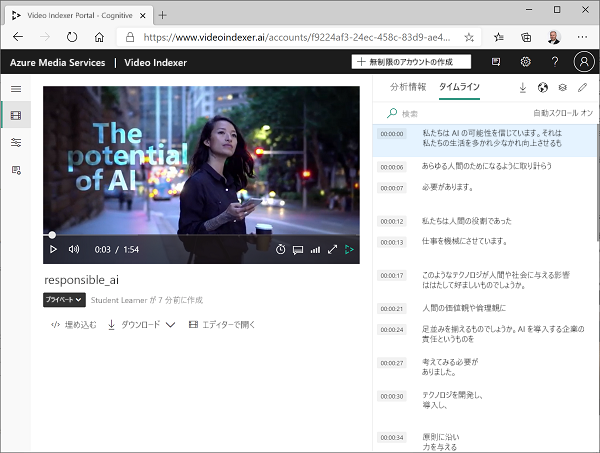
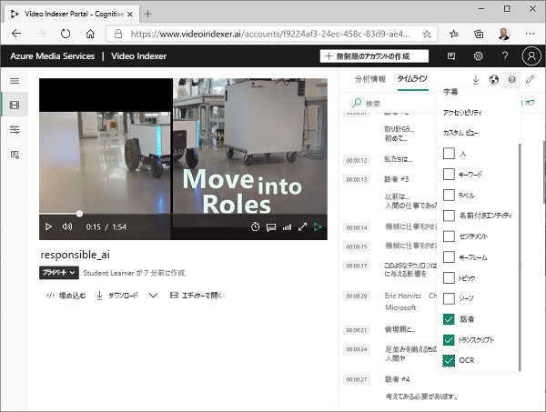
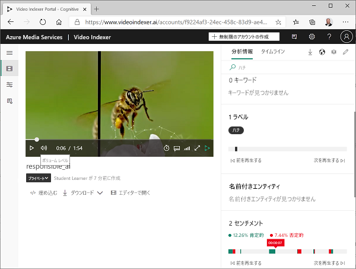
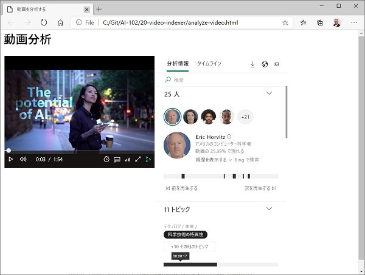

---
lab:
  title: Video Analyzer を使用する動画の分析
  module: Module 8 - Getting Started with Computer Vision
---

# Video Analyzer を使用する動画の分析

今日作成および消費されているデータの大部分は動画形式です。 **Video Analyzer for Media** は、AI を利用したサービスであり、動画のインデックスを作成し、そこからインサイトを抽出するために使用できます。

> **注**:2022 年 6 月 21 日から、個人を特定できる情報を返すコグニティブ サービスの機能は、[制限付きアクセス](https://docs.microsoft.com/azure/cognitive-services/cognitive-services-limited-access)が許可されているお客様に限定されます。 制限付きアクセスの承認を得ていない場合、このラボの Video Analyzer を使用して人や著名人を認識することはできません。 Microsoft が行った変更と理由について詳しくは、「[顔認識に対する責任ある AI 投資と保護](https://azure.microsoft.com/blog/responsible-ai-investments-and-safeguards-for-facial-recognition/)」をご覧ください。

## このコースのリポジトリを複製する

**AI-102-AIEngineer** コード リポジトリをこのラボの作業をしている環境に既にクローンしている場合は、Visual Studio Code で開きます。それ以外の場合は、次の手順に従って今すぐクローンしてください。

1. Visual Studio Code を起動します。
2. パレットを開き (SHIFT+CTRL+P)、**Git:Clone** コマンドを実行して、`https://github.com/MicrosoftLearning/AI-102-AIEngineer` リポジトリをローカル フォルダーに複製します (どのフォルダーでも問題ありません)。
3. リポジトリを複製したら、Visual Studio Code でフォルダーを開きます。
4. リポジトリ内の C# コード プロジェクトをサポートするために追加のファイルがインストールされるまで待ちます。

    > **注**: ビルドとデバッグに必要なアセットを追加するように求めるダイアログが表示された場合は、 **[今はしない]** を選択します。

## 動画を Video Analyzer にアップロードする

最初に、Video Analyzer ポータルにサインインして、動画をアップロードする必要があります。

> **ヒント**: ホストされているラボ環境で Video Analyzer ページの読み込みが遅い場合は、ローカルにインストールされているブラウザーを使用してください。 後のタスクのために、ホストされている VM に戻すことができます。

1. ブラウザーで、Video Analyzer ポータル (`https://www.videoindexer.ai`) を開きます。
2. 既存の Video Analyzer アカウントがある場合は、サインインします。 それ以外の場合は、無料アカウントにサインアップし、Microsoft アカウント (またはその他の有効なアカウントの種類) を使ってサインインします。 サインインに問題がある場合は、プライベート ブラウザー セッションを開いてみてください。
3. Video Analyzer で、**[アップロード]** オプションを選びます。 次に、**ファイルの URL を入力する**オプションを選び、`https://aka.ms/responsible-ai-video` と入力します。 デフォルト名を **Responsible AI** に変更し、既定の設定を確認し、チェックボックスを選択して顔認識に関する Microsoft のポリシーに準拠していることを確認し、ファイルをアップロードします。
4. ファイルがアップロードされたら、Video Analyzer が自動的にインデックスを作成するまで数分待ちます。

> **注**: この演習では、この動画を使用して Video Analyzer の機能を調べます。ただし、AI 対応アプリケーションを責任を持って開発するための有用な情報とガイダンスが含まれているため、演習が終了したら、時間をかけて完全に確認する必要があります。 

## ビデオ インサイトの確認

インデックス作成プロセスは、ポータルで表示できる動画からインサイトを抽出します。

1. Video Analyzer ポータルで、動画にインデックスが付けられたら、それを選択して表示します。 動画から抽出されたインサイトを示すペインの横にビデオ プレーヤーが表示されます。

![ビデオ プレーヤーと [インサイト] ペインを備えた Video Analyzer](./images/video-indexer-insights.png)

2. 動画の再生中に、**[タイムライン]** タブを選択して、動画オーディオのトランスクリプトを表示します。

3. ポータルの右上にある **[表示]** 記号 (&#128455; に似ています) を選択し、インサイトのリストで、**[トランスクリプト]** に加えて、**[OCR]** と **[スピーカー]** を選択します。

4. **[タイムライン]** ペインに次のものが含まれていることを確認します。
    - 音声ナレーションのトランスクリプト。
    - 動画に表示されるテキスト。
    - 動画に登場するスピーカーの表示。 よく知られている人の中には、名前で自動的に認識される人もいれば、番号で示される人もいます (たとえば、*スピーカー #1*)。
5. **[インサイト]** ペインに戻り、そこに表示されるインサイトを表示します。 これには次のようなものがあります。
    - ビデオに表示される個々の人。
    - ビデオで議論されたトピック。
    - ビデオに表示されるオブジェクトのラベル。
    - ビデオに表示される人物やブランドなどの名前付きエンティティ。
    - キー シーン。
6. **[インサイト]** ペインが表示されている状態で、**[ビュー]** 記号を再度選択し、インサイトのリストで **[キーワード]** と **[感情]** をペインに追加します。

    見つかったインサイトは、動画の主なテーマを決定するのに役立ちます。 たとえば、この動画の**トピック**は、テクノロジー、社会的責任、および倫理に関するものであることを明確に示しています。

## インサイトを検索する

Video Analyzer を使用して、動画でインサイトを検索できます。

1. **[インサイト]** ペインの **[検索]** ボックスに、「*Bee*」と入力します。 すべてのタイプのインサイトの結果を表示するには、[インサイト] ペインを下にスクロールする必要がある場合があります。
2. 下に示されている動画の場所で、一致する *ラベル* が 1 つ見つかったことを確認します。
3. ミツバチの存在が示されているセクションの先頭を選択し、その時点で動画を表示します (動画を一時停止して慎重に選択する必要がある場合があります。ミツバチは短時間しか表示されません。)
4. 動画のすべてのインサイトを表示するには、**[検索]** ボックスをクリアします。

## Video Analyzer ウィジェットを使用する

Video Analyzer サーポータルは、動画インデックス プロジェクトを管理するための便利なインターフェイスです。 ただし、Video Analyzer アカウントにアクセスできないユーザーが動画とそのインサイトを利用できるようにしたい場合があります。 Video Analyzer は、この目的のために Web ページに埋め込むことができるウィジェットを提供します。

1. Visual Studio Code の **16-video-indexer** フォルダーで、**analyze-video.html** を開きます。 これは、Video Analyzer の **[プレーヤー]** ウィジェットと **[インサイト]** ウィジェットを追加する基本的な HTML ページです。 ヘッダー内の **vb.widgets.mediator.js** スクリプトへの参照に注意してください。このスクリプトにより、ページ上の複数の Video Analyzer ウィジェットが相互に対話できるようになります。
2. Video Analyzer ポータルで、**[メディア ファイル]** ページに戻り、**責任ある AI** 動画を開きます。
3. ビデオ プレーヤーの下の **[&lt;/&gt; 埋め込み]** を選択し、HTML iframe コードを表示して、ウィジェットを埋め込みます。
4. **[共有と埋め込み]** ダイアログ ボックスで、**[プレーヤー]** ウィジェットを選択し、動画サイズを 560 x 315 に設定してから、埋め込みコードをクリップボードにコピーします。
5. Visual Studio Code の **analyze-video.html** ファイルで、コピーしたコードをコメント "**&lt;-- Player widget goes here -- &gt;**" の下に貼り付けます。
6. **[共有と埋め込み]** ダイアログボックスに戻り、**[インサイト]** ウィジェットを選択して、埋め込みコードをクリップボードにコピーします。 次に、**[共有と埋め込み]** ダイアログボックスを閉じ、Visual Studio Code に戻って、コピーしたコードをコメント "**&lt;-- Insights widget goes here -- &gt;**" の下に貼り付けます。
7. ファイルを保存します。 次に、**[エクスプローラー]** ペインで、**analyze-video.html** を右クリックし、**[ファイルエクスプローラーで表示]** を選択します。
8. ブラウザーのファイル エクスプローラーで、**analyze-video.html** を開き、Web ページを表示します。
9. **[インサイト]** ウィジェットを使用してウィジェットを試して、「insights」を検索し、動画内でそれらにジャンプします。

## Video Analyzer REST API を使用する

Video Analyzer は、アカウントに動画をアップロードおよび管理するために使用できる REST API を提供します。

### API の詳細を取得する

Video Analyzer APIを使用するには、リクエストを認証するための情報が必要です。

1. Video Analyzer ポータルで、メニュー (≡) を展開し、**[アカウント設定]** ページを選択します。
2. このページの**アカウント ID** に注意してください。後で必要になります。
3. 新しいブラウザー タブを開き、Video Analyzer 開発者ポータル (`https://api-portal.videoindexer.ai`) に移動し、Video Analyzer アカウントの資格情報を使用してサインインします。
4. **[プロファイル]** ページで、プロファイルに関連付けられた**サブスクリプション**を表示します。
5. サブスクリプションのあるページで、サブスクリプションごとに 2 つのキー (プライマリとセカンダリ) が割り当てられていることを確認します。 次に、いずれかのキーの **[表示]** を選択して表示します。 このキーはまもなく必要になります。

### REST API を使用する

アカウント ID と API キーを取得したので、REST API を使用してアカウント内の動画を操作できます。 この手順では、PowerShell スクリプトを使用して REST 呼び出しを行います。ただし、cURL や Postman などの HTTP ユーティリティ、または JSON over HTTP を送受信できるプログラミング言語にも同じ原則が適用されます。

Video Analyzer REST API とのすべての対話は、同じパターンに従います。

- ヘッダーに API キーを含む **AccessToken** メソッドへの最初の要求は、アクセス トークンを取得するために使用されます。
- 後続のリクエストは、REST メソッドを呼び出して動画を操作するときに、アクセス トークンを使用して認証します。

1. Visual Studio Code の **16-video-indexer** フォルダーで、**get-videos.ps1** を開きます。
2. PowerShell スクリプトで、**YOUR_ACCOUNT_ID** および **YOUR_API_KEY** プレースホルダーを、以前に識別したアカウント ID および API キーの値に置き換えます。
3. 無料アカウントの *location* が "trial" であることに注意してください。 無制限の Video Analyzer アカウント (関連付けられた Azure リソースを含む) を作成した場合は、これを Azure リソースがプロビジョニングされている場所 ("eastus" など) に変更できます。
4. スクリプトのコードを確認し、2 つの REST メソッドを呼び出すことに注意してください。1 つはアクセス トークンを取得するためのもので、もう 1 つはアカウント内の動画を一覧表示するためのものです。
5. 変更を保存してから、[スクリプト] ペインの右上で、**[&#9655;]** ボタンを使用して、スクリプトを実行します。
6. REST サービスからの JSON 応答を表示します。これには、以前にインデックスを作成した**責任のある AI** 動画の詳細が含まれているはずです。

## 詳細情報

人や著名人の認識は引き続き利用できますが、[責任ある AI 標準](https://aka.ms/aah91ff)に従うと、制限付きアクセス ポリシーで制限されます。 これらの機能には、顔の識別と有名人の認識が含まれます。 詳細とアクセスの申請については、[Cognitive Services の制限付きアクセス](https://docs.microsoft.com/en-us/azure/cognitive-services/cognitive-services-limited-access)に関するページを参照してください。

**Video Analyzer** の詳細については、[Video Analyzer のドキュメント](https://docs.microsoft.com/azure/azure-video-analyzer/video-analyzer-for-media-docs/)を参照してください。
