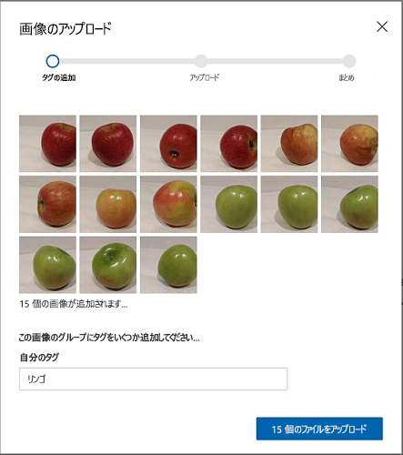
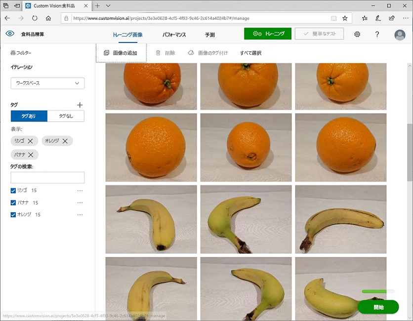
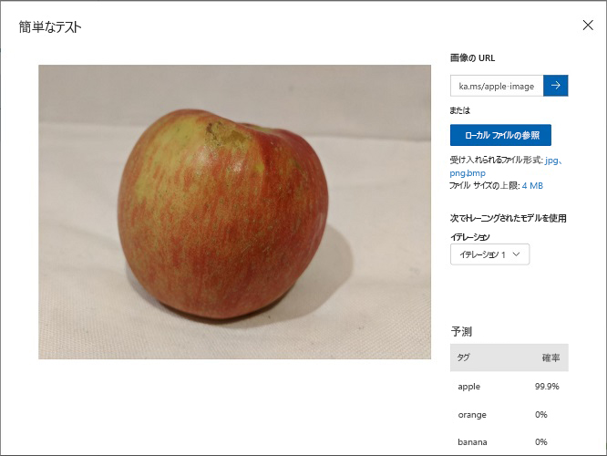

---
lab:
    title: 'Custom Vision を使用する画像の分類'
    module: 'モジュール 9 - Custom Vision ソリューションを開発する'
---

# Custom Vision を使用する画像の分類

**Computer Vision** を使用すると、独自の画像でトレーニングされた Computer Vision モデルを作成できます。これを使用して、*画像分類*および*物体検出*モデルをトレーニングできます。その後、公開してアプリケーションから利用できます。

この演習では、Computer Vision サービスを使用して、果物の 3 つのクラス (リンゴ、バナナ、オレンジ) を識別できる画像分類モデルをトレーニングします。

## このコースのリポジトリを複製する

**AI-102-AIEngineer** コードのリポジトリをこのラボで作業している環境にまだ複製していない場合は、次の手順に従って複製してください。それ以外の場合は、複製されたフォルダーを Visual Studio Code で開きます。

1. Visual Studio Code を起動します。
2. パレットを開き (SHIFT+CTRL+P)、**Git: Clone** コマンドを実行して、`https://github.com/MicrosoftLearning/AI-102JA-Designing-and-Implementing-a-Microsoft-Azure-AI-Solution` リポジトリをローカル フォルダーに複製します (どのフォルダーでもかまいません)。
3. リポジトリを複製したら、Visual Studio Code でフォルダーを開きます。
4. リポジトリ内の C# コード プロジェクトをサポートするために追加のファイルがインストールされるまで待ちます。

    > **注**: ビルドとデバッグに必要なアセットを追加するように求められた場合は、**「今はしない」** を選択します。

## Custom Vision リソースを作成する

モデルをトレーニングする前に、*トレーニング*と*予測*のために Azure リソースが必要になります。これらのタスクごとに **Custom Vision** リソースを作成することも、単一の **Cognitive Services** リソースを作成していずれか (または両方) に使用することもできます。

この演習では、トレーニングと予測用の **Custom Vision** リソースを作成して、これらのワークロードのアクセスとコストを個別に管理できるようにします。

1. 新しいブラウザータブで、`https://portal.azure.com` で Azure portalを開き、Azure サブスクリプションに関連付けられている Microsoft アカウントを使用してサインインします。
2. **&#65291;「リソースの作成」** ボタンを選択し、*Custom Vision* を検索して、次の設定で **Custom Vision** リソースを作成します。
    - **作成オプション**: 両方
    - **サブスクリプション**: *お使いの Azure サブスクリプション*
    - **リソース グループ**: *リソース グループを選択または作成します (制限付きサブスクリプションを使用している場合は、新しいリソース グループを作成する権限がない可能性があります - 提供されているものを使用してください)*
    - **名前**: *一意の名前を入力します*
    - **トレーニング場所**: *利用可能な任意のリージョンを選択します*
    - **トレーニングに価格レベル**: F0
    - **予測の場所**: *トレーニングリソースと同じリージョン*
    - **予測の価格レベル**: F0

    > **注**: サブスクリプションにすでに F0 Custom Vision サービスがある場合は、このサービスに **S0** を選択してください。

3. リソースが作成されるのを待ってから、デプロイの詳細を表示し、2 つの Custom Vision リソースがプロビジョニングされていることに注意してください。1 つはトレーニング用で、もう 1 つは予測用です。これらを作成したリソース グループに移動すると、これらを表示できます。

> **重要**: 各リソースには独自の*エンドポイント*と*キー*があり、コードからのアクセスを管理するために使用されます。画像分類モデルをトレーニングするには、コードで*トレーニング* リソース (エンドポイントとキーを含む) を使用する必要があります。トレーニング済みモデルを使用して画像クラスを予測するには、コードで*予測*リソース (エンドポイントとキーを含む) を使用する必要があります。

## Custom Vision プロジェクトを作成する

画像分類モデルをトレーニングするには、トレーニング リソースに基づいて Custom Vision プロジェクトを作成する必要があります。これを行うには、Custom Vision ポータルを使用します。

1. Visual Studio Code で、リポジトリを複製した **17-image-classification/training-images** フォルダ－にあるトレーニング イメージを表示します。このフォルダーには、リンゴ、バナナ、オレンジの画像のサブフォルダーが含まれています。
2. 新しいブラウザー タブで、`https://customvision.ai`にある Custom Vision ポータルを開きます。プロンプトが表示されたら、Azure サブスクリプションに関連付けられている Microsof tアカウントを使用してサインインし、利用規約に同意します。
3. Custom Vision ポータルで、次の設定で新しいプロジェクトを作成します。
    - **名前**: Classify Fruit
    - **説明**: フルーツの画像分類
    - **リソース**: *以前に作成した Custom Vision リソース*
    - **プロジェクトの種類**: 分類
    - **分類の種類**: マルチ (画像ごとに 1 つのタグ)
    - **ドメイン**: Food
4. 新しいプロジェクトで、**「\「+\」画像を追加」** をクリックし、前に表示した **training-images/apple** フォルダー内のすべてのファイルを選択します。次に、次のようにタグ *apple* を指定して、画像ファイルをアップロードします


   
5. 前の手順を繰り返して、*banana* タグ付きの **banana** フォルダー内の画像と、*orange* タグ付きの **orange** フォルダー内の画像をアップロードします。
6. Custom Vision プロジェクトでアップロードした画像を探索します - 次のように、各クラスの画像が 15 個あるはずです。


    
7. Custom Vision プロジェクトでは、画像の上にある **「トレーニング」 **をクリックしげ、タグ付けされた画像を使用して分類モデルをトレーニングします。**「クイックトレーニング」** オプションを選択し、トレーニングの反復が完了するのを待ちます (これには 1 分ほどかかる場合があります)。
8. モデルの反復がトレーニングされたら、*適合率*、*再現率*、および *AP* のパフォーマンスメトリックを確認します。これらは分類モデルの予測精度を測定し、すべて高いはずです。

> **注**: パフォーマンス メトリックは、各予測の 50％ の確率しきい値に基づいています (つまり、モデルが特定のクラスの画像である確率が 50％ 以上であると計算した場合、そのクラスが予測されます)。これはページの左上で調整できます。

## モデルをテストする

モデルをトレーニングしたので、テストできます。

1. パフォーマンス メトリックの上にある **「クイック テスト」** をクリックします。
2. **「画像の URL」** ボックスに`https://aka.ms/apple-image`と入力し、「&#10132;」 をクリックします。
3. モデルによって返される予測を表示します。次のように、*リンゴ*の確率スコアが最も高くなります。



4. **「クイック テスト」** ウィンドウを閉じます。

## プロジェクト設定を表示する

作成したプロジェクトには一意の識別子が割り当てられており、それを操作するコードで指定する必要があります。

1. **「パフォーマンス」** ページの右上にある*設定* (&#9881;) アイコンをクリックして、プロジェクトの設定を表示します。
2. **「一般」** (左側) の下で、このプロジェクトを一意に識別する **「プロジェクト ID」** に注意してください。
3. 右側の **「リソース」** の下に、キーとエンドポイントを含む*トレーニング* リソースの詳細が表示されていることに注意してください (この情報は、Azure portal でリソースを表示することでも取得できます)。

## *トレーニング* API を使用する

Custom Vision ポータルは、画像のアップロードとタグ付け、およびモデルのトレーニングに使用できる便利なユーザー インターフェイスを提供します。ただし、シナリオによっては、Custom Vision トレーニング API を使用してモデル トレーニングを自動化することができます。

> **注**: この演習では、**C#** または **Python** SDK のいずれかから API を使用することを選択できます。以下の手順で、希望する言語に適したアクションを実行します。

1. Visual Studio Code の**エクスプローラー** ペインで、**17-image_classification** フォルダーを参照し、言語の設定に応じて **C-Sharp** または **Python** フォルダーを展開します。
2. **train-classifier** フォルダーを右クリックして、統合ターミナルを開きます。次に、言語設定のための適切なコマンドを実行して、Custom Vision トレーニング パッケージをインストールします。

**C#**

```
dotnet add package Microsoft.Azure.CognitiveServices.Vision.CustomVision.Training --version 2.0.0
```

**Python**

```
pip install azure-cognitiveservices-vision-customvision==3.1.0
```

3. **train-classifier** フォルダーの内容を表示し、構成設定用のファイルが含まれていることに注意してください。
    - **C#**: appsettings.json
    - **Python**: .env

    構成ファイルを開き、含まれている構成値を更新して、Custom Vision *トレーニング* リソースのエンドポイントとキー、および以前に作成した分類プロジェクトのプロジェクト ID を反映します。変更を保存します。
4. **train-classifier** フォルダーには、クライアント アプリケーションのコード ファイルが含まれていることに注意してください。

    - **C#**: Program.cs
    - **Python**: train-classifier.py

    コード ファイルを開き、含まれているコードを確認して、次の詳細に注意してください。
    - インストールしたパッケージの名前空間インポートされます
    - **Main** 関数は、構成設定を取得し、キーとエンドポイントを使用して認証済みの **CustomVisionTrainingClient** を作成します。これは、プロジェクト ID とともに使用され、プロジェクトへの**プロジェクト**参照を作成します。
    - **Upload_Images** 関数は、Custom Vision プロジェクトで定義されているタグを取得し、対応する名前のフォルダーからプロジェクトに画像ファイルをアップロードして、適切なタグ ID を割り当てます。
    - **Train_Model** 関数は、プロジェクトの新しいトレーニング反復を作成し、トレーニングが完了するのを待ちます。
5. **train-classifier** フォルダーの統合ターミナルに戻り、次のコマンドを入力してプログラムを実行します。

**C#**

```
dotnet run
```

**Python**

```
python train-classifier.py
```
    
6. プログラムが終了するのを待ちます。次に、ブラウザーに戻り、Custom Vision ポータルでプロジェクトの **「トレーニング イメージ」** ページを表示します (必要に応じてブラウザーを更新します)。
7. いくつかの新しいタグ付き画像がプロジェクトに追加されていることを確認します。次に、**「パフォーマンス」** ページを表示し、新しいイテレーションが作成されたことを確認します。

## 画像分類モデルを公開する

これで、トレーニング済みモデルを公開して、クライアント アプリケーションから使用できるようにする準備が整いました。

1. Custom Vision ポータルの **「パフォーマンス」** ページで、**「公開」** をクリックして、トレーニング済みモデルを次の設定で公開します。
    - **モデル名**: fruit-classifier
    - **予測リソース**: *以前に作成した**予測**リソース (トレーニングリソースでは<u>ありません</u>)*。
2. **「プロジェクト設定」** ページの左上にある *「プロジェクトギャラリー」* (&#128065;) アイコンをクリックして、プロジェクトが一覧表示されている Custom Vision ポータルの 「ホーム」 ページに戻ります。
3. Custom Vision ポータルの 「ホーム」 ページの右上にある*設定* (&#9881;) アイコンをクリックして、Custom Vision サービスの設定を表示します。次に、**「リソース」** の下で、*予測*リソース (トレーニング リソースでは<u>ありません</u>) を見つけて、その**キー**と**エンドオプション**の値を決定します (この情報は、Azure portal のリソースで表示して取得することもできます)。

## クライアント アプリケーションからの画像分類子を使用する

画像分類モデルを公開したので、クライアント アプリケーションからそれを使用できます。ここでも、**C#** または **Python**.のどちらを使用するかを選択できます。

1. Visual Studio Code の **17-image-classification** フォルダーで、希望する言語 (**C-Sharp**または**Python**) のサブフォルダーで、**test-classifier** フォルダーを右に移動し、統合ターミナルを開きます。その後、Custom Vision 予測パッケージをインストールするには、次の SDK 特有のコマンドを入力します

**C#**

```
dotnet add package Microsoft.Azure.CognitiveServices.Vision.CustomVision.Prediction --version 2.0.0
```

**Python**

```
pip install azure-cognitiveservices-vision-customvision==3.1.0
```

> **注**: Python SDK パッケージには、トレーニング パッケージと予測パッケージの両方が含まれており、既にインストールされている場合があります。

2. **test-classifier** フォルダーを展開して、そこに含まれるファイルを表示します。これらのファイルは、画像分類モデルのテスト クライアント アプリケーションを実装するために使用されます。
3. クライアントアプリケーションの構成ファイル (C# の場合は *appsettings.json*、Python の場合は *env*) を開き、Custom Vision *予測*リソースのエンドポイントとキー、分類プロジェクトのプロジェクト ID、および公開されたモデルの名前 (*fruit-classifier* である必要があります) を反映するように、含まれている構成値を更新します。変更を保存します。
4. クライアント アプリケーションのコード ファイル (C# の場合は *Program.cs*、Python の場合は *test-classification.py*) を開き、含まれているコードを確認して、次の詳細に注意してください。
    - インストールしたパッケージの名前空間インポートされます
    - **Main** 関数は構成設定を取得し、キーとエンドポイントを使用して認証済みの **CustomVisionPredictionClient** を作成します。
    - 予測クライアント オブジェクトは、**test-images** フォルダー内の各画像のクラスを予測するために使用され、各リクエストのプロジェクト ID とモデル名を指定します。各予測には、可能なクラスごとの確率が含まれ、確率が 50% を超える予測タグのみが表示されます。
5. **test-classifier** フォルダーの統合ターミナルに戻り、次のコマンドを入力してプログラムを実行します。

**C#**

```
dotnet run
```

**Python**

```
python test-classifier.py
```

6. 各予測のラベル (タグ) ）と確率スコアを表示します。**test-images** フォルダー内の画像を表示して、モデルがそれらを正しく分類したことを確認できます。

## 詳細

Custom Vision サービスを使用した画像分類の詳細については、[Custom Vision のドキュメント](https://docs.microsoft.com/azure/cognitive-services/custom-vision-service/)を参照してください。
