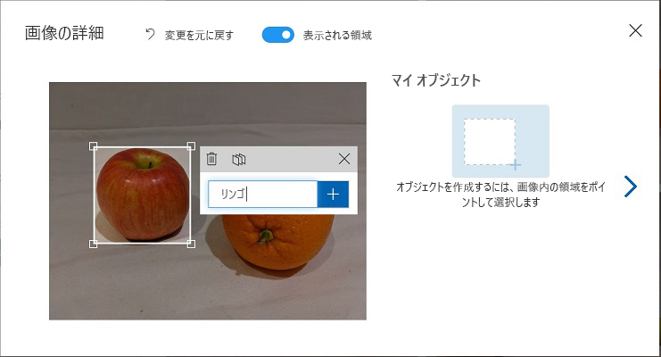
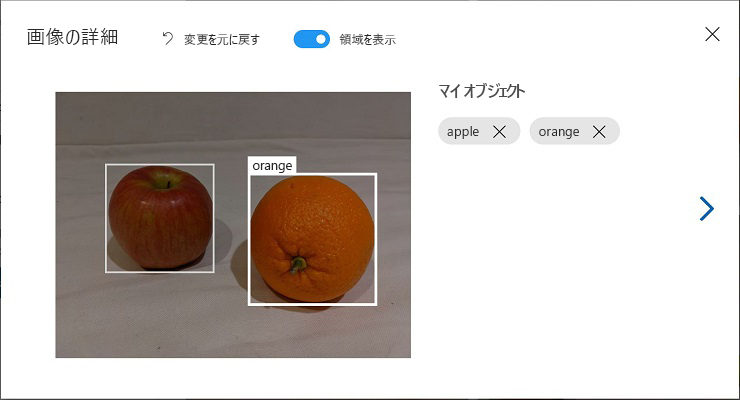
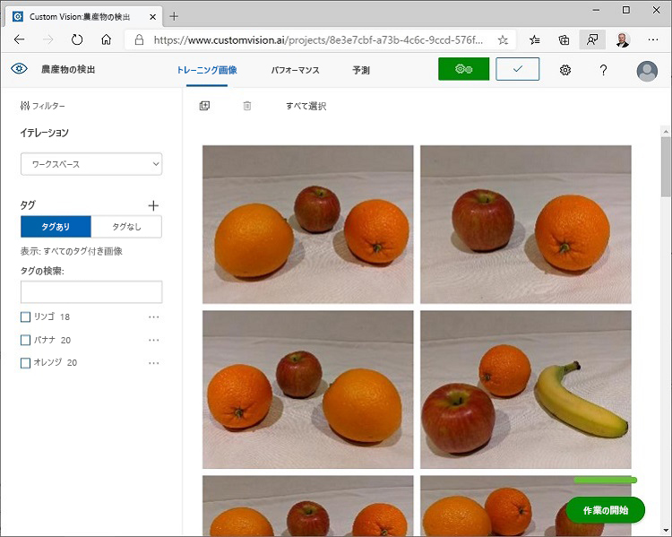

---
lab:
  title: Custom Vision 使用する画像内の物体の検出
  module: Module 9 - Developing Custom Vision Solutions
---

# <a name="detect-objects-in-images-with-custom-vision"></a>Custom Vision 使用する画像内の物体の検出

この演習では、Custom Vision サービスを使用して、画像内の 3 つのクラスの果物 (リンゴ、バナナ、オレンジ) を検出して特定できる *物体検出* モデルをトレーニングします。

## <a name="clone-the-repository-for-this-course"></a>このコースのリポジトリを複製する

**AI-102-AIEngineer** コード リポジトリをこのラボの作業をしている環境に既にクローンしている場合は、Visual Studio Code で開きます。それ以外の場合は、次の手順に従って今すぐクローンしてください。

1. Visual Studio Code を起動します。
2. パレットを開き (SHIFT+CTRL+P)、**Git:Clone** コマンドを実行して、`https://github.com/MicrosoftLearning/AI-102-AIEngineer` リポジトリをローカル フォルダーに複製します (どのフォルダーでも問題ありません)。
3. リポジトリを複製したら、Visual Studio Code でフォルダーを開きます。
4. リポジトリ内の C# コード プロジェクトをサポートするために追加のファイルがインストールされるまで待ちます。

    > **注**: ビルドとデバッグに必要なアセットを追加するように求めるダイアログが表示された場合は、 **[今はしない]** を選択します。

## <a name="create-custom-vision-resources"></a>Custom Vision リソースを作成する

Azure サブスクリプションでトレーニングと予測のための **Custom Vision** リソースが既にある場合は、この演習でそれらを使用できます。 そうでない場合は、次の手順を使用して作成してください。

1. 新しいブラウザー タブで Azure portal (`https://portal.azure.com`) を開き、自分の Azure サブスクリプションに関連付けられている Microsoft アカウントを使用してサインインします。
2. **[&#65291;リソースの作成]** ボタンを選択し、*custom vision* を検索して、次の設定で **Custom Vision** リソースを作成します。
    - **作成オプション**: 両方
    - **[サブスクリプション]**:"*ご自身の Azure サブスクリプション*"
    - **リソース グループ**: "*リソース グループを選択または作成します (制限付きサブスクリプションを使用している場合は、新しいリソース グループを作成する権限がないことがあります。提供されているものを使ってください)* "
    - **[リージョン]**: 使用できるリージョンを選択します**
    - **[名前]**: *一意の名前を入力します*
    - **トレーニング価格レベル**: F0
    - **[予測価格レベル]**: F0

    > **注**: サブスクリプションに既に F0 Custom Vision サービスがある場合は、このサービスに **S0** を選択してください。

3. リソースが作成されるのを待ってから、デプロイの詳細を表示し、2 つの Custom Vision リソースがプロビジョニングされていることに注意してください。1 つはトレーニング用で、もう 1 つは予測用です ( **-Prediction** サフィックスで示されます)。 これらを作成したリソース グループに移動すると、これらを表示できます。

> **重要**: 各リソースには独自の *エンドポイント* と *キー* があり、コードからのアクセスを管理するために使用されます。 画像分類モデルをトレーニングするには、コードで *トレーニング* リソース (エンドポイントとキーを含む) を使用する必要があります。トレーニング済みモデルを使用して画像クラスを予測するには、コードで *予測* リソース (エンドポイントとキーを含む) を使用する必要があります。

## <a name="create-a-custom-vision-project"></a>Custom Vision プロジェクトを作成する

物体検出モデルをトレーニングするには、トレーニング リソースに基づいて Custom Vision プロジェクトを作成する必要があります。 これを行うには、Custom Vision ポータルを使用します。

1. 新しいブラウザー タブで Custom Vision ポータル (`https://customvision.ai`) を開き、ご利用の Azure サブスクリプションに関連付けられている Microsoft アカウントを使用してサインインします。
2. 次の設定で新しいプロジェクトを作成します。
    - **名前**: 果物の検出
    - **説明**: 果物の物体検出。
    - **リソース**: 以前に作成した Custom Vision リソース
    - **プロジェクトの種類**: 物体検出(Object Detection)
    - **ドメイン**: General
3. プロジェクトが作成され、ブラウザーで開かれるまで待ちます。

## <a name="add-and-tag-images"></a>画像を追加してタグを付ける

物体検出モデルをトレーニングするには、モデルで識別するクラスが含まれている画像をアップロードし、各物体インスタンスの境界ボックスを示すためにタグを付ける必要があります。

1. Visual Studio Code で、リポジトリをクローンした **18-object-detection/training-images** フォルダ－にあるトレーニン画像を表示します。 このフォルダーには果物の画像が含まれています。
2. Custom Vision ポータルの物体検出プロジェクトで、 **[画像の追加]** を選択し、抽出したフォルダーのすべての画像をアップロードします。
3. 画像がアップロードされた後、最初のものを選択して開きます。
4. 以下の画像のように、自動的に検出された領域が表示されるまで、画像内の任意の物体の上にマウス ポインターを置きます。 その後、物体を選択し、必要に応じて、それを囲む領域のサイズを変更します。


単に物体の周りをドラッグして領域を作成することもできます。

5. 領域で物体が囲まれたら、次に示すように、適切な物体の種類 (*apple*、*banana*、または *orange*) で新しいタグを追加します。



6. 画像内の互いの物体を選択してタグを付け、必要に応じて領域のサイズを変更し、新しいタグを追加します。



7. 右側の **[>]** リンクを使用して、次の画像に移動し、その物体にタグを付けます。 その後、単に画像のコレクション全体で引き続き作業を行い、apple、banana、および orange にそれぞれタグを付けます。

8. 最後の画像のタグ付けが終了したら、**[Image Detail]\(画像の詳細\)** エディターを閉じ、**[画像のトレーニング]** ページの **[タグ]** で **[タグ付け]** を選択して、タグ付けされたすべての画像を表示します。



## <a name="use-the-training-api-to-upload-images"></a>Training API を使用して画像をアップロードする

Custom Vision ポータルのグラフィカル ツールを使用して画像にタグを付けることができますが、多くの AI 開発チームは、画像内のタグとオブジェクト領域に関する情報を含むファイルを生成する他のツールを使用しています。 このようなシナリオでは、Custom Vision トレーニング API を使用して、タグ付けされた画像をプロジェクトにアップロードできます。

> **注**: この演習では、**C#** または **Python** SDK のいずれかから API を使用することを選択できます。 以下の手順で、希望する言語に適したアクションを実行します。

1. Custom Vision ポータルの **[画像のトレーニング]** ページの右上にある *設定* (&#9881;) アイコンをクリックして、プロジェクトの設定を表示します。
2. **[一般]** (左側) の下で、このプロジェクトを一意に識別する **[プロジェクト ID]** に注意してください。
3. 右側の **[リソース]** の下に、キーとエンドポイントが表示されていることに注意してください。 これらは、*トレーニング* リソースの詳細です (この情報は、Azure portal でリソースを表示することでも取得できます)。
4. Visual Studio Code の **18-object-detection** フォルダーの下で、言語の設定に応じて **C-Sharp** または **Python** フォルダーを展開します。
5. **train-detector** フォルダーを右クリックして、統合ターミナルを開きます。 次に、言語設定のための適切なコマンドを実行して、Custom Vision トレーニング パッケージをインストールします。

**C#**

```
dotnet add package Microsoft.Azure.CognitiveServices.Vision.CustomVision.Training --version 2.0.0
```

**Python**

```
pip install azure-cognitiveservices-vision-customvision==3.1.0
```

6. **train-detector** フォルダーの内容を表示し、構成設定用のファイルが含まれていることに注意してください。
    - **C#** : appsettings.json
    - **Python**: .env

    構成ファイルを開き、含まれている構成値を更新して、Custom Vision *トレーニング* リソースのエンドポイントとキー、および以前に作成した物体検出プロジェクトのプロジェクト ID を反映します。 変更を保存します。

7. **train-detector** フォルダーで **taged-images.json** を開き、そこに含まれている JSON を調べます。 JSON は画像のリストを定義し、各画像には 1 つ以上のタグ付き領域が含まれています。 タグ付けされた各領域には、タグ名、タグ付けされたオブジェクトを含む境界ボックスの上下の座標と幅と高さの寸法が含まれます。

    > **注**: このファイルの座標と寸法は、画像上の相対点を示しています。 たとえば、*高さ* の値が 0.7 の場合、ボックスは画像の高さの 70% であることを示します。 一部のタグ付けツールは、座標と寸法の値がピクセル、インチ、またはその他の測定単位を表す他の形式のファイルを生成します。

8. **train-detector** フォルダーには、JSON ファイルで参照されている画像ファイルが保存されているサブフォルダーが含まれていることに注意してください。


9. **train-detector** フォルダーには、クライアント アプリケーションのコード ファイルが含まれていることに注意してください

    - **C#** : Program.cs
    - **Python**: train-detector.py

    コード ファイルを開き、含まれているコードを確認して、次の詳細に注意してください。
    - インストールしたパッケージの名前空間インポートされます
    - **Main** 関数は、構成設定を取得し、キーとエンドポイントを使用して認証済みの **CustomVisionTrainingClient** を作成します。これは、プロジェクト ID とともに使用され、プロジェクトへの**プロジェクト**参照を作成します。
    - **Upload_Images** 関数は、JSON ファイルからタグ付けされた領域情報を抽出し、それを使用して領域を含む画像のバッチを作成し、それをプロジェクトにアップロードします。
10. **train-detector** フォルダーの統合ターミナルに戻り、次のコマンドを入力してプログラムを実行します。
    
**C#**

```
dotnet run
```

**Python**

```
python train-detector.py
```
    
11. プログラムが終了するのを待ちます。 次に、ブラウザーに戻り、Custom Vision ポータルでプロジェクトの **[画像のトレーニング]** ページを表示します (必要に応じてブラウザーを更新します)。
12. いくつかの新しいタグ付き画像がプロジェクトに追加されていることを確認します。

## <a name="train-and-test-a-model"></a>モデルをトレーニングしてテストする

これでプロジェクト内の画像にタグを付けたので、モデルをトレーニングする準備ができました。

1. Custom Vision プロジェクトで、**[トレーニング]** をクリックして、タグ付けされた画像を使用して物体検出モデルをトレーニングします。 **[クイック トレーニング]** オプションを選択します。
2. トレーニングが完了するのを待ってから (10 分ほどかかる場合があります)、*正確性*、*再現性*、*mAP* などのパフォーマンス指標を確認します。これらは分類モデルの予測精度の指標であり、すべて高い値を示しているはずです。
3. ページの右上にある **[クイック テスト]** をクリックしてから、**[画像の URL]** ボックスに、「`https://aka.ms/apple-orange`」と入力し、生成された予測を表示します。 その後、**[クイック テスト]** ウィンドウを閉じます。

## <a name="publish-the-object-detection-model"></a>物体検出モデルを公開する

これで、トレーニング済みモデルを公開して、クライアント アプリケーションから使用できるようにする準備が整いました。

1. Custom Vision ポータルの **[パフォーマンス]** ページで、 **[&#128504; 公開]** をクリックして、トレーニング済みモデルを次の設定で公開します。
    - **モデル名**: fruit-detector
    - **予測リソース**: *前に作成した "-Prediction" で終わる**予測**リソース (トレーニング リソースでは<u>ありません</u>)。*
2. **[プロジェクト設定]** ページの左上にある *[プロジェクトギャラリー]* (&#128065) アイコンをクリックして、プロジェクトが一覧表示されている Custom Vision ポータルの [ホーム] ページに戻ります。
3. Custom Vision ポータルの [ホーム] ページの右上にある *設定* (&#9881;) アイコンをクリックして、Custom Vision サービスの設定を表示します。 次に、 **[リソース]** の下で、"-Prediction" で終わる *予測* リソース (トレーニング リソースでは<u>ありません</u>) を見つけて、その**キー**と**エンドポイント**の値を確認します (この情報は、Azure portal のリソースで表示して取得することもできます)。

## <a name="use-the-image-classifier-from-a-client-application"></a>クライアント アプリケーションからの画像分類子を使用する

画像分類モデルを公開したので、クライアント アプリケーションからそれを使用できます。 ここでも、**C#** または **Python** のどちらを使用するかを選択できます。

1. Visual Studio Code で、**18-object-detection** フォルダーを参照し、使用する言語のフォルダー (**C-Sharp** または **Python**) で、**test-detector** フォルダーを展開します。
2. **test-detector** フォルダーを右クリックして、統合ターミナルを開きます。 その後、Custom Vision 予測パッケージをインストールするには、次の SDK 特有のコマンドを入力します

**C#**

```
dotnet add package Microsoft.Azure.CognitiveServices.Vision.CustomVision.Prediction --version 2.0.0
```

**Python**

```
pip install azure-cognitiveservices-vision-customvision==3.1.0
```

> **注**: Python SDK パッケージには、トレーニング パッケージと予測パッケージの両方が含まれており、既にインストールされている場合があります。

3. クライアントアプリケーションの構成ファイル (C# の場合は *appsettings.json*、Python の場合は *.env*) を開き、Custom Vision *予測* リソースのエンドポイントとキー、物体検出プロジェクトのプロジェクト ID、および公開されたモデルの名前 (*fruit-detector* である必要があります) を反映するように、含まれている構成値を更新します。 変更を保存します。
4. クライアント アプリケーションのコード ファイル (C# の場合は *Program.cs*、Python の場合は *test-detector.py*) を開き、含まれているコードを確認して、次の詳細に注意してください。
    - インストールしたパッケージの名前空間インポートされます
    - **Main** 関数は構成設定を取得し、キーとエンドポイントを使用して認証済みの **CustomVisionPredictionClient** を作成します。
    - 予測クライアント オブジェクトは、リクエストでプロジェクト ID とモデル名を指定して、**produce.jpg** 画像の物体検出予測を取得するために使用されます。 次に、予測されたタグ付き領域が画像に描画され、結果が **output.jpg** として保存されます。
5. **test-detector** フォルダーの統合ターミナルに戻り、次のコマンドを入力してプログラムを実行します。

**C#**

```
dotnet run
```

**Python**

```
python test-detector.py
```

6. プログラムが完了した後、結果の **output.jpg** ファイルを表示して、画像内で検出されたオブジェクトを確認します。

## <a name="more-information"></a>詳細情報

Custom Vision サービスを使用した物体検出の詳細については、[Custom Vision のドキュメント](https://docs.microsoft.com/azure/cognitive-services/custom-vision-service/)を参照してください。
