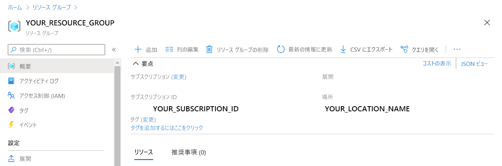

---
lab:
  title: Forms からのデータの抽出
  module: Module 11 - Reading Text in Images and Documents
---

# <a name="extract-data-from-forms"></a>Forms からのデータの抽出 

ある会社が現在、手動で注文シートを購入し、データベースにデータを入力することを社員に求めているとします。 会社は AI サービスを活用してデータ入力プロセスを改善したいと考えています。 あなたは、フォームを読み取り、(データベースを自動的に更新するために使用できる) 構造化データを生成する機械学習モデルを構築することに決めます。

**Form Recognizer** は、ユーザーが自動データ処理ソフトウェアを構築できるようにする Cognitive Services です。 このソフトウェアは、光学式文字認識 (OCR) を使用して、フォーム ドキュメントからテキスト、キーと値のペア、およびテーブルを抽出できます。 Form Recognizer には、請求書、領収書、名刺を認識するためのモデルがあらかじめ構築されています。 このサービスは、カスタム モデルをトレーニングする機能も提供します。 この演習では、カスタム モデルの構築に焦点を当てます。

## <a name="clone-the-repository-for-this-course"></a>このコースのリポジトリを複製する

まだ行っていない場合は、このコースのコード リポジトリを複製する必要があります。

1. Visual Studio Code を起動します。
2. パレットを開き (SHIFT+CTRL+P)、**Git:Clone** コマンドを実行して、`https://github.com/MicrosoftLearning/AI-102-AIEngineer` リポジトリをローカル フォルダーに複製します (どのフォルダーでも問題ありません)。
3. リポジトリを複製したら、Visual Studio Code でフォルダーを開きます。
4. リポジトリ内の C# コード プロジェクトをサポートするために追加のファイルがインストールされるまで待ちます。

    > **注**: ビルドとデバッグに必要なアセットを追加するように求めるダイアログが表示された場合は、 **[今はしない]** を選択します。

## <a name="create-a-form-recognizer-resource"></a>Form Recognizer リソースを作成する

Form Recognizer サービスを使用するには、Azure サブスクリプションに Form Recognizer または Cognitive Services リソースが必要です。 Azure portal を使用してリソースを作成します。

1.  Azure portal (`https://portal.azure.com`) を開き、ご利用の Azure サブスクリプションに関連付けられている Microsoft アカウントを使用してサインインします。

2. **[&#65291;リソースの作成]** ボタンを選択し、*Form Recognizer* を検索して、次の設定で **Form Recognizer** リソースを作成します。
    - **[サブスクリプション]**:"*ご自身の Azure サブスクリプション*"
    - **リソース グループ**: "*リソース グループを選択または作成します (制限付きサブスクリプションを使用している場合は、新しいリソース グループを作成する権限がないことがあります。提供されているものを使ってください)* "
    - **[リージョン]**: 使用できるリージョンを選択します**
    - **[名前]**: *一意の名前を入力します*
    - **[価格レベル]**: F0

    > **注**: サブスクリプションに既に F0 Form Recognizer サービスがある場合は、このサービスに **S0** を選択してください。

3. リソースがデプロイされたら、そこに移動して、その **[キーとエンドポイント]** ページを表示します。 後でコードからのアクセスを管理するには、このページの**エンドポイント**と**キー**の 1 つが必要になります。 

## <a name="gather-documents-for-training"></a>トレーニング用のドキュメントを収集する

  

このリポジトリの **21-custom-form/sample-forms** フォルダーのサンプル フォームを使用します。このサンプル フォームには、モデルをトレーニングし、テストするために必要なすべてのファイルが含まれています。

1. Visual Studio Code の **21-custom-form** フォルダーで、**sample-forms** フォルダーを展開します。 フォルダー内に **.json** と **.jpg** で終わるファイルがあることに注意してください。

    **.jpg** ファイルを使用し、モデルをトレーニングします。  

    **.json** ファイルが生成され、ラベル情報が含まれています。 ファイルは、フォームと共に BLOB ストレージ コンテナーにアップロードされます。 

2. Azure portal ([https://portal.azure.com](https://portal.azure.com)) に戻ります。

3. 以前に Form Recognizer リソースを作成した**リソース グループ**を表示します。

4. リソース グループの **[概要]** ページで、**サブスクリプション ID** と**場所**を記録します。 これらの値は、後続の手順で**リソース グループ**名とともに必要になります。



5. Visual Studio Code のエクスプローラー ペインで、**21-custom-form** フォルダーを右クリックし、 **[Open in Integrated Terminal]\(統合ターミナルで開く\)** を選択します。

6. ターミナル ペインで、次のコマンドを入力して、お使いの Azure サブスクリプションへの認証された接続を確立します。
    
```
az login --output none
```

7. メッセージ表示されたら、Azure サブスクリプションにサインインします。 その後、Visual Studio Code に戻り、サインイン プロセスが完了するまで待ちます。

8. 次のコマンドを実行して、Azure の場所を一覧表示します。

```
az account list-locations -o table
```

9. 出力で、リソース グループの場所に対応する **Name** の値を見つけます (たとえば、*米国東部* の場合、対応する名前は *eastus* です)。

    > **重要**: **Name** の値を記録しておき、手順 12 で使用します。

10. [エクスプローラー] ペインの **21-custom-form** フォルダーで、**setup.cmd** を選択します。 このバッチス クリプトを使用して、必要な他の Azure リソースを作成するために必要な Azure コマンド ライン インターフェイス (CLI) コマンドを実行します。

11. **setup.cmd** スクリプトで、**rem** コマンドを確認します。 これらのコメントは、スクリプトが実行するプログラムの概要を示しています。 プログラムは次のことを行います。 
    - リソース グループにストレージ アカウントを作成する
    - ローカルの _sampleforms_ フォルダーからストレージ アカウントの _sampleforms_ というコンテナーにファイルをアップロードする
    - 共有アクセス署名 URI を印刷する

12. **subscription_id**、**resource_group**、**location** 変数の宣言を、Form Recognizer リソースをデプロイしたサブスクリプション、リソース グループ、およびロケーション名に適切な値で変更します。 その後、変更を**保存**します。

    **expiry_date** 変数は、演習用のままにしておきます。 この変数は、共有アクセス署名 (SAS) URI を生成するときに使用されます。 実際には、SAS に適切な有効期限を設定する必要があります。 SAS について詳しくは、[こちら](https://docs.microsoft.com/azure/storage/common/storage-sas-overview#how-a-shared-access-signature-works)をご覧ください。  

13. **21-custom-form** フォルダーのターミナルで、次のコマンドを入力してスクリプトを実行します。

```
setup
```

14. スクリプトが完了したら、表示された出力を確認し、Azure リソースの SAS URI をメモします。

> **重要**: 進む前に、後で再度取得できる場所に SAS URI を貼り付けてください (たとえば、Visual Studio Code の新しいテキスト ファイルに)。

15. Azure portal で、リソース グループを更新し、作成したばかりの Azure ストレージ アカウントが含まれていることを確認します。 ストレージ アカウントを開き、左側のペインで **[ストレージ ブラウザー (プレビュー)]** を選択します。 次に、ストレージ ブラウザーで、 **[BLOB コンテナー]** を展開し、**sampleforms** コンテナーを選択して、ファイルがローカルの **21-custom-form/sample-forms** フォルダーからアップロードされていることを確認します。

## <a name="train-a-model-using-the-form-recognizer-sdk"></a>Form Recognizer SDK を使用してモデルをトレーニングする

次に、 **.jpg** ファイルと **.json** ファイルを使用してモデルをトレーニングします。

1. Visual Studio Code の **21-custom-form/sample-forms** フォルダーで、**fields.json** を開き、そこに含まれている JSON ドキュメントを確認します。 このファイルは、フォームから抽出するためにモデルをトレーニングするフィールドを定義します。
2. **Form_1.jpg.labels.json** を開き、そこに含まれる JSON を確認します。 このファイルは、**Form_1.jpg** トレーニング ドキュメントの名前付きフィールドの場所と値を識別します。
3. **Form_1.jpg.ocr.json** を開き、そこに含まれる JSON を確認します。 このファイルには、**Form_1.jpg** のテキストレイアウトの JSOn 表現が含まれています。これには、フォームで見つかったすべてのテキスト領域の場所が含まれます。

    *この演習では、フィールド情報ファイルが提供されています。独自のプロジェクトの場合、[Form Recognizer Studio](https://formrecognizer.appliedai.azure.com/studio) を利用し、これらのファイルを作成できます。ツールを使用すると、フィールド情報ファイルが自動的に作成され、接続しているストレージ アカウントに保存されます。*

4. Visual Studio Code の **21-custom-form** フォルダーで、言語の設定に応じて **C-Sharp** フォルダーまたは **Python** フォルダーを展開します。
5. **train-model** フォルダーを右クリックして、統合ターミナルを開きます。

6. お使いの言語設定のための適切なコマンドを実行して、フォームの認識器のパッケージをインストールします

**C#**

```
dotnet add package Azure.AI.FormRecognizer --version 3.0.0 
```

**Python**

```
pip install azure-ai-formrecognizer==3.0.0
```

7. **train-model** フォルダーの内容を表示し、構成設定用のファイルが含まれていることに注意してください
    - **C#** : appsettings.json
    - **Python**: .env

8. 構成ファイルを編集し、以下を反映するように設定を変更します
    - Form Recognizer リソースの**エンドポイント**。
    - Form Recognizer リソースの**キー**。
    - BLOB コンテナーの **SAS URI**。

9. **train-model** フォルダーには、クライアント アプリケーションのコード ファイルが含まれていることに注意してください

    - **C#** : Program.cs
    - **Python**: train-model.py

    コード ファイルを開き、含まれているコードを確認して、次の詳細に注意してください。
    - インストールしたパッケージの名前空間インポートされます
    - **Main** 関数は構成設定を取得し、キーとエンドポイントを使用して認証済みの **Client** を作成します。
    - このコードは、トレーニングクライアントを使用して、生成した SAS URI を使用してアクセスされる BLOB ストレージ コンテナー内の画像を使用してモデルをトレーニングします。

10. **train-model** フォルダーで、トレーニング アプリケーションのコード ファイルを開きます。

    - **C#** : Program.cs
    - **Python**: train-model.py

11. **train-model** フォルダーの統合ターミナルに戻り、次のコマンドを入力してプログラムを実行します。

**C#**

```
dotnet run
```

**Python**

```
python train-model.py
```

12. 最後に、プログラムの待ち、その後、モデル出力を確認します。
13. ターミナル出力のモデル ID を書き出します。 次のラボ パートに必要になります。 

## <a name="test-your-custom-form-recognizer-model"></a>カスタム Form Recognizer モデルをテストする 

1. **21-custom-form** フォルダーで、使用する言語のサブフォルダー (**C-Sharp** または **Python**) の **test-model** フォルダーを展開します。

2. **test-model** フォルダーを右クリックし、**統合ターミナル**を選択します。

3. **test-model** フォルダーのターミナルで、言語設定に適したコマンドを実行して、Form Recognizer パッケージをインストールします。

**C#**

```
dotnet add package Azure.AI.FormRecognizer --version 3.0.0 
```

**Python**

```
pip install azure-ai-formrecognizer==3.0.0
```

*以前に pip を使用してパッケージを Python 環境にインストールしたことがある場合、これは厳密には必要ありません。しかし、それがインストールされていることを確認しても害はありません。*

4. **test-model** フォルダーの同じターミナルに、Tabulate ライブラリをインストールします。 これにより、テーブルに出力されます。

**C#**

```
dotnet add package Tabulate.NET --version 1.0.5
```

**Python**

```
pip install tabulate
```

5. **test-model** フォルダーで、構成ファイル (言語設定に応じて **appsettings.json** または **.env**) を編集して、次の値を追加します。
    - Form Recognizer エンドポイント。
    - Form Recognizer キー。
    - モデルのトレーニング時に生成されたモデル ID (これは、ターミナルを **train-model** フォルダーの **cmd** コンソールに戻すことで確認できます)。 変更内容を**保存**します。

6. **test-model** フォルダーで、クライアント アプリケーションのコード ファイル (C# の場合は *Program.cs*、Python の場合は *test-model.py*) を開き、含まれているコードを確認して、次の詳細に注意してください。
    - インストールしたパッケージの名前空間インポートされます
    - **Main** 関数は構成設定を取得し、キーとエンドポイントを使用して認証済みの **Client** を作成します。
    - 次に、クライアントを使用して、**test1.jpg** 画像からフォーム フィールドと値を抽出します。
    

7. **test-model** フォルダーの統合ターミナルに戻り、次のコマンドを入力してプログラムを実行します。

**C#**

```
dotnet run
```

**Python**

```
python test-model.py
```
    
8. 出力を表示し、"CompanyPhoneNumber" や "DatedAs" などのフィールド名がモデルの出力に含まれる様子を観察します。   

## <a name="more-information"></a>詳細情報

Form Recognizer サービスの詳細については、[Form Recognizer のドキュメント](https://docs.microsoft.com/azure/cognitive-services/form-recognizer/)を参照してください。
